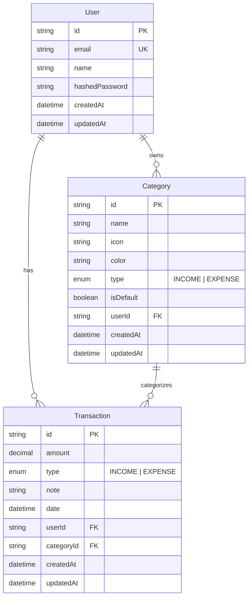

# Data Model — Personal Finance Tracker

> **Loại tài liệu:** Design
> **Cập nhật lần cuối:** 2026-03-09

---

## 1. Entity Relationship Diagram



---

## 2. Mô tả chi tiết từng Entity

### User

| Field | Type | Constraint | Mô tả |
|---|---|---|---|
| `id` | String | PK, CUID | ID tự động sinh |
| `email` | String | Unique, Not Null | Email đăng nhập |
| `name` | String | Nullable | Tên hiển thị |
| `hashedPassword` | String | Nullable | Null nếu dùng OAuth |
| `createdAt` | DateTime | Auto | Ngày tạo |
| `updatedAt` | DateTime | Auto | Ngày cập nhật |

---

### Category

| Field | Type | Constraint | Mô tả |
|---|---|---|---|
| `id` | String | PK, CUID | ID tự động sinh |
| `name` | String | Not Null | Tên danh mục |
| `icon` | String | Nullable | Emoji hoặc icon name |
| `color` | String | Nullable | Hex color code |
| `type` | Enum | Not Null | `INCOME` hoặc `EXPENSE` |
| `isDefault` | Boolean | Default false | Danh mục hệ thống |
| `userId` | String | FK → User | Chủ sở hữu |
| `createdAt` | DateTime | Auto | Ngày tạo |
| `updatedAt` | DateTime | Auto | Ngày cập nhật |

**Unique constraint:** `(name, type, userId)` — Không được trùng tên + loại trong cùng user

---

### Transaction

| Field | Type | Constraint | Mô tả |
|---|---|---|---|
| `id` | String | PK, CUID | ID tự động sinh |
| `amount` | Decimal | Not Null, > 0 | Số tiền (VNĐ) |
| `type` | Enum | Not Null | `INCOME` hoặc `EXPENSE` |
| `note` | String | Nullable, max 255 | Ghi chú |
| `date` | DateTime | Not Null | Ngày giao dịch |
| `userId` | String | FK → User | Chủ sở hữu |
| `categoryId` | String | FK → Category | Danh mục |
| `createdAt` | DateTime | Auto | Ngày tạo record |
| `updatedAt` | DateTime | Auto | Ngày cập nhật |

---

## 3. Prisma Schema

```prisma
// prisma/schema.prisma

generator client {
  provider = "prisma-client-js"
}

datasource db {
  provider = "postgresql"
  url      = env("DATABASE_URL")
}

enum TransactionType {
  INCOME
  EXPENSE
}

model User {
  id             String        @id @default(cuid())
  email          String        @unique
  name           String?
  hashedPassword String?
  createdAt      DateTime      @default(now())
  updatedAt      DateTime      @updatedAt
  transactions   Transaction[]
  categories     Category[]
}

model Category {
  id           String          @id @default(cuid())
  name         String
  icon         String?
  color        String?
  type         TransactionType
  isDefault    Boolean         @default(false)
  userId       String
  user         User            @relation(fields: [userId], references: [id], onDelete: Cascade)
  transactions Transaction[]
  createdAt    DateTime        @default(now())
  updatedAt    DateTime        @updatedAt

  @@unique([name, type, userId])
}

model Transaction {
  id         String          @id @default(cuid())
  amount     Decimal         @db.Decimal(15, 0)
  type       TransactionType
  note       String?         @db.VarChar(255)
  date       DateTime
  userId     String
  user       User            @relation(fields: [userId], references: [id], onDelete: Cascade)
  categoryId String
  category   Category        @relation(fields: [categoryId], references: [id])
  createdAt  DateTime        @default(now())
  updatedAt  DateTime        @updatedAt
}
```

---

## 4. Seed Data — Danh mục mặc định

```typescript
// prisma/seed.ts
const defaultCategories = [
  // EXPENSE
  { name: "Ăn uống",          type: "EXPENSE", icon: "🍜", color: "#FF6B6B" },
  { name: "Đi lại",           type: "EXPENSE", icon: "🚗", color: "#4ECDC4" },
  { name: "Mua sắm",          type: "EXPENSE", icon: "🛍️", color: "#45B7D1" },
  { name: "Nhà ở & Tiện ích", type: "EXPENSE", icon: "🏠", color: "#96CEB4" },
  { name: "Giải trí",         type: "EXPENSE", icon: "🎬", color: "#FFEAA7" },
  { name: "Sức khỏe",         type: "EXPENSE", icon: "💊", color: "#DDA0DD" },
  { name: "Giáo dục",         type: "EXPENSE", icon: "📚", color: "#98D8C8" },
  { name: "Khác (Chi)",       type: "EXPENSE", icon: "💸", color: "#B8B8B8" },
  // INCOME
  { name: "Lương",            type: "INCOME",  icon: "💰", color: "#2ECC71" },
  { name: "Thưởng",           type: "INCOME",  icon: "🎁", color: "#3498DB" },
  { name: "Đầu tư",           type: "INCOME",  icon: "📈", color: "#9B59B6" },
  { name: "Thu nhập phụ",     type: "INCOME",  icon: "💼", color: "#E67E22" },
  { name: "Khác (Thu)",       type: "INCOME",  icon: "💵", color: "#95A5A6" },
];
```
