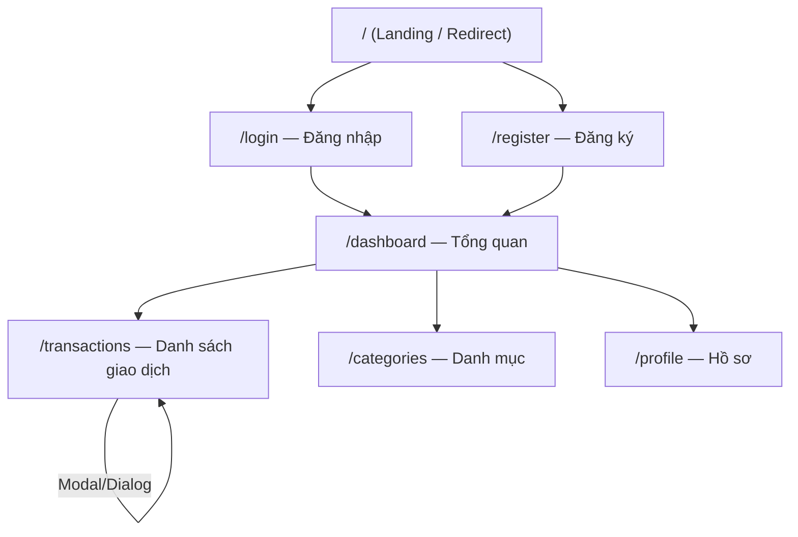

# UI/UX Screens — Personal Finance Tracker

> **Loại tài liệu:** Design
> **Cập nhật lần cuối:** 2026-03-09

---

## Navigation Flow



---

## Danh sách màn hình

| # | Route | Mục đích | Auth |
|---|---|---|---|
| 1 | `/` | Landing page, redirect nếu đã login | Public |
| 2 | `/login` | Đăng nhập | Public |
| 3 | `/register` | Đăng ký tài khoản | Public |
| 4 | `/dashboard` | Tổng quan tài chính | Protected |
| 5 | `/transactions` | Danh sách + CRUD giao dịch | Protected |
| 6 | `/categories` | Quản lý danh mục | Protected |
| 7 | `/profile` | Quản lý tài khoản | Protected |

---

### 1. Landing Page `/`

| Thành phần | Mô tả |
|---|---|
| **Mục đích** | Giới thiệu app, redirect user về dashboard nếu đã đăng nhập |
| **Components** | Hero section, Features section, CTA buttons (Login / Register) |
| **Actions** | Click Login → `/login`, Click Register → `/register` |

---

### 2. Login Page `/login`

| Thành phần | Mô tả |
|---|---|
| **Mục đích** | Xác thực người dùng |
| **Components** | Form: Email input, Password input, Submit button, Link đến Register |
| **Actions** | Submit form → gọi `signIn()`, redirect `/dashboard` nếu thành công |
| **Validation** | Email format hợp lệ, password required |

---

### 3. Register Page `/register`

| Thành phần | Mô tả |
|---|---|
| **Mục đích** | Tạo tài khoản mới |
| **Components** | Form: Name, Email, Password, Confirm Password, Submit, Link Login |
| **Actions** | Submit → tạo user + seed danh mục mặc định → redirect `/login` |
| **Validation** | Email unique, password ≥ 8 ký tự, confirm match |

---

### 4. Dashboard `/dashboard`

| Thành phần | Mô tả |
|---|---|
| **Mục đích** | Tổng quan tài chính |
| **Components** | Summary Cards (Số dư, Tổng thu, Tổng chi) |
| | Month Selector — chọn tháng/năm |
| | Line Chart — thu/chi theo ngày (Recharts) |
| | Pie Chart — chi tiêu theo danh mục (Recharts) |
| | Recent Transactions — 5 giao dịch gần nhất |
| **Actions** | Đổi tháng → re-fetch data |

---

### 5. Transactions `/transactions`

| Thành phần | Mô tả |
|---|---|
| **Mục đích** | Xem và quản lý toàn bộ giao dịch |
| **Components** | Filter Bar: Tháng, Loại (Thu/Chi), Danh mục |
| | Transaction Table: Ngày, Danh mục, Ghi chú, Số tiền, Actions |
| | Button "Thêm giao dịch" |
| | Pagination |
| **Actions** | Click Thêm → mở Dialog, Click Sửa → mở Dialog pre-filled, Click Xóa → confirm |

> **Note:** Add/Edit Transaction dùng Dialog (shadcn/ui) thay vì trang riêng để UX mượt hơn.

---

### 6. Categories `/categories`

| Thành phần | Mô tả |
|---|---|
| **Mục đích** | Xem và quản lý danh mục |
| **Components** | Tab Chi / Thu |
| | Category Grid: icon, tên, màu, nút sửa/xóa |
| | Button "Thêm danh mục" |
| | Dialog thêm/sửa |
| **Actions** | Thêm/Sửa/Xóa danh mục |

---

### 7. Profile `/profile`

| Thành phần | Mô tả |
|---|---|
| **Mục đích** | Quản lý tài khoản |
| **Components** | Avatar + tên, email |
| | Form đổi tên hiển thị |
| | Form đổi mật khẩu |
| | Nút Sign out |
| **Actions** | Cập nhật profile, đổi mật khẩu, đăng xuất |

---

## Layout chung (App Layout)

```
┌─────────────────────────────────────────────────┐
│  🏦 Finance Tracker        [Avatar] [Sign out]  │  ← Header
├──────────────┬──────────────────────────────────┤
│  📊 Dashboard │                                  │
│  💸 Giao dịch │         Main Content Area        │
│  🏷️ Danh mục  │                                  │
│  👤 Profile   │                                  │
│              │                                  │
└──────────────┴──────────────────────────────────┘
  ← Sidebar (desktop) / Bottom nav (mobile ≤ 768px)
```
