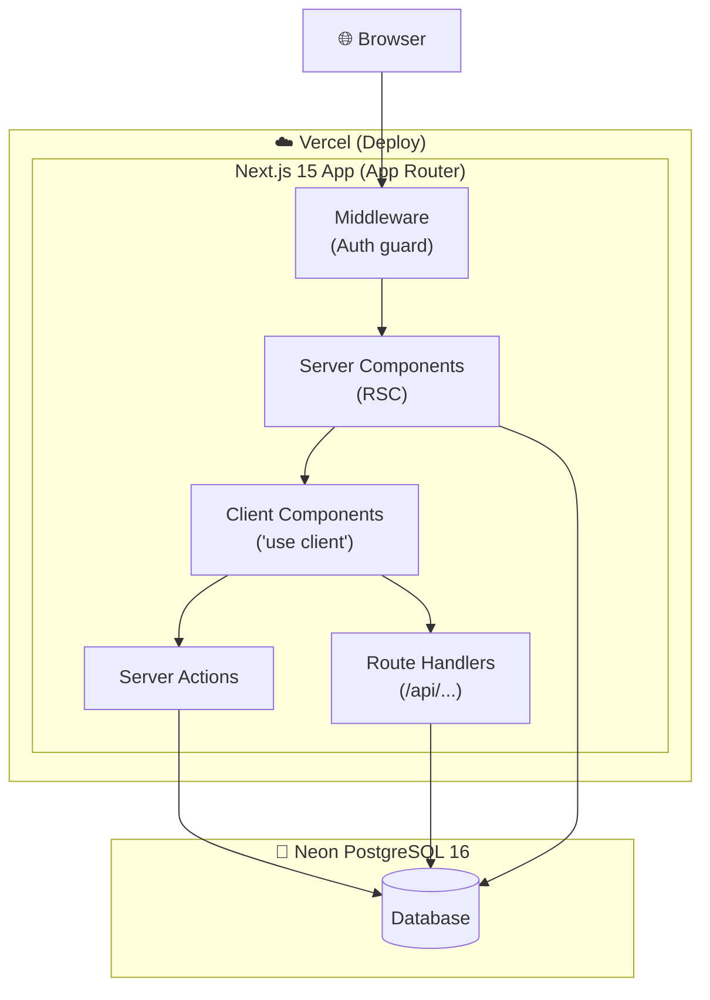
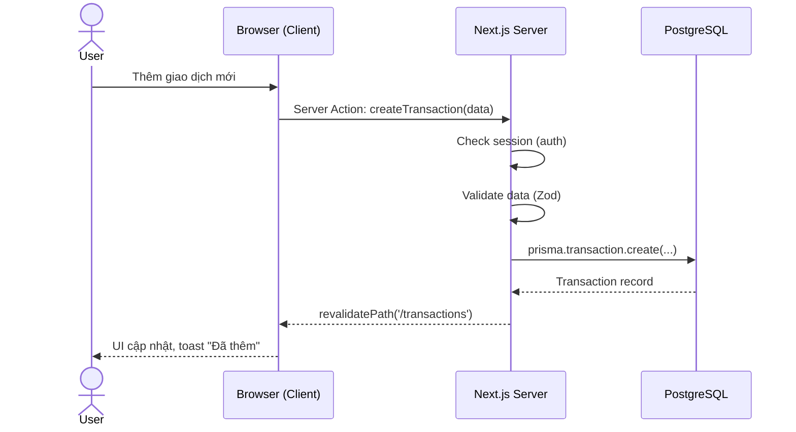
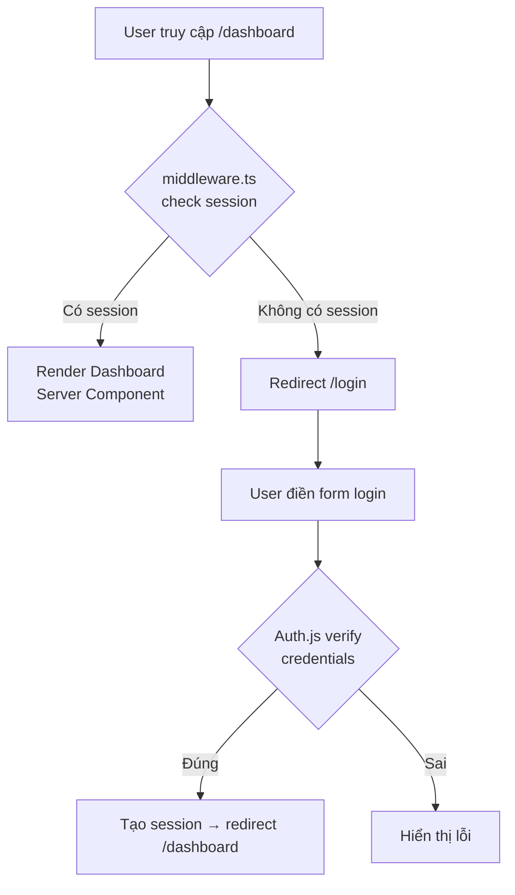

# System Architecture — Personal Finance Tracker

> **Loại tài liệu:** Design / Engineering
> **Cập nhật lần cuối:** 2026-03-09

> 📐 **Tech Stack chi tiết và Coding Conventions** → xem [4-engineering/coding-conventions.md](../4-engineering/coding-conventions.md)

---

## 1. Component Diagram



---

## 2. Folder Structure (Next.js App Router)

```
personal-finance-tracker/
├── docs/                      # Documentation (xem README.md)
├── prisma/
│   ├── schema.prisma          # Database schema — source of truth
│   └── seed.ts                # Seed danh mục mặc định
├── public/
├── src/
│   ├── app/                   # Next.js App Router
│   │   ├── (auth)/            # Route group: trang xác thực (public)
│   │   │   ├── login/page.tsx
│   │   │   ├── register/page.tsx
│   │   │   └── layout.tsx     # Layout centered, không sidebar
│   │   ├── (app)/             # Route group: protected pages
│   │   │   ├── layout.tsx     # Layout sidebar + header
│   │   │   ├── dashboard/page.tsx
│   │   │   ├── transactions/page.tsx
│   │   │   ├── categories/page.tsx
│   │   │   └── profile/page.tsx
│   │   ├── api/
│   │   │   ├── auth/[...nextauth]/route.ts
│   │   │   ├── transactions/
│   │   │   │   ├── route.ts       # GET, POST
│   │   │   │   └── [id]/route.ts  # PATCH, DELETE
│   │   │   ├── categories/
│   │   │   │   ├── route.ts
│   │   │   │   └── [id]/route.ts
│   │   │   └── dashboard/
│   │   │       └── summary/route.ts
│   │   ├── layout.tsx         # Root layout — font, metadata
│   │   └── page.tsx           # Landing page
│   ├── components/
│   │   ├── ui/                # shadcn/ui components (auto-generated)
│   │   ├── layout/            # Sidebar, Header, BottomNav
│   │   ├── dashboard/
│   │   ├── transactions/
│   │   ├── categories/
│   │   ├── profile/
│   │   └── landing/
│   ├── stores/                # Zustand global state
│   │   └── useUIStore.ts
│   ├── lib/
│   │   ├── auth.ts            # Auth.js config
│   │   ├── db.ts              # Prisma client singleton
│   │   ├── utils.ts           # Helpers: formatCurrency, cn()
│   │   └── validations.ts     # Zod schemas
│   ├── actions/               # Server Actions (tách riêng)
│   │   ├── transaction.actions.ts
│   │   ├── category.actions.ts
│   │   └── auth.actions.ts
│   ├── types/
│   │   └── index.ts           # Shared TypeScript types
│   └── middleware.ts          # Auth middleware — bảo vệ route (app)
├── .env.local                 # Environment variables (không commit)
├── next.config.ts
├── tsconfig.json
└── package.json
```

---

## 3. Data Flow — Thêm giao dịch



---

## 4. Authentication Flow



---

## 5. State Management Strategy

| Loại state | Giải pháp | Lý do |
|---|---|---|
| Filter, pagination, search | URL state (`nuqs`) | Shareable, SEO-friendly, persist on refresh |
| Modal open/close, sidebar | Zustand (`useUIStore`) | Client-only, không cần URL |
| Server data (transactions…) | Server Component + Server Actions | Single source of truth |
| Form state | `react-hook-form` | Local component state |
